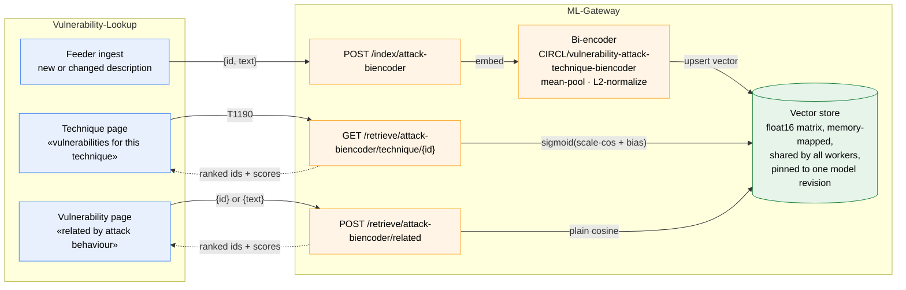
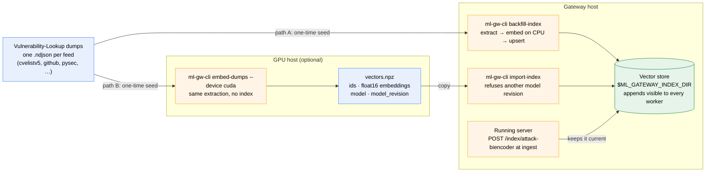

# Retrieval with the ATT&CK bi-encoder

[`CIRCL/vulnerability-attack-technique-biencoder`](https://huggingface.co/CIRCL/vulnerability-attack-technique-biencoder)
embeds vulnerability descriptions and ATT&CK technique texts in one vector
space. The classification head
([`…-classification-roberta-base`](https://huggingface.co/CIRCL/vulnerability-attack-technique-classification-roberta-base))
only answers *which techniques for this CVE*; the bi-encoder also answers
*which CVEs for this technique* and *which CVEs behave like this one*,
because every text becomes a fixed vector and scoring is a dot product.
This page is the contract for consumers that want those two directions —
ML-Gateway (serves the model) and Vulnerability-Lookup (stores the vectors
and runs the search). It states exactly how to reproduce the training-time
scoring function; nothing here requires VulnTrain at run time.

**What is measured and what is not.** The paper
({doc}`attack-techniques-dataset`) evaluates the CVE→technique direction
only: recall@5 0.643 on the 53-technique vocabulary, 0.515 over all 222
enterprise parent techniques, macro-F1 0.212 versus 0.176 for the head.
Technique→CVE retrieval and CVE→CVE similarity use the same space and the
same trained similarity, but have no reported numbers. Ship them as search
aids, not as classifications.

## What the release ships

| File | Content |
|---|---|
| model weights + tokenizer | a plain `roberta-base` encoder (`AutoModel`), no classification head |
| `config.json` → `biencoder` | `labels` (the 53 trained technique IDs, in training order), `logit_scale`, `logit_bias`, `technique_max_length`, `holdout_techniques` (empty for the release) |
| `technique_texts.json` | `{technique_id: "Name. Description"}` for the 53 trained techniques, STIX markup stripped, as used at training time |

## Scoring function

Every text (CVE description or technique text) goes through the same
three steps: encode, mean-pool over the attention mask, L2-normalize.
The similarity of two vectors is their cosine (dot product of unit
vectors). For CVE→technique scoring, the training-time probability is an
affine transform of the cosine followed by a sigmoid, with the two
constants read from the config:

```
p(technique | cve) = sigmoid(logit_scale · cos(v_cve, v_technique) + logit_bias)
```

Self-contained reference implementation (only `torch` and `transformers`):

```python
import json
import torch
from huggingface_hub import hf_hub_download
from transformers import AutoModel, AutoTokenizer

MODEL = "CIRCL/vulnerability-attack-technique-biencoder"

tokenizer = AutoTokenizer.from_pretrained(MODEL)
encoder = AutoModel.from_pretrained(MODEL).eval()
cfg = encoder.config.biencoder
scale, bias = float(cfg["logit_scale"]), float(cfg["logit_bias"])
technique_max_length = int(cfg["technique_max_length"])
with open(hf_hub_download(MODEL, "technique_texts.json"), encoding="utf-8") as f:
    technique_texts = json.load(f)


def embed(texts: list[str], max_length: int = 512, batch_size: int = 64) -> torch.Tensor:
    """Mean-pooled, L2-normalized embeddings, shape (len(texts), 768)."""
    out = []
    for start in range(0, len(texts), batch_size):
        batch = tokenizer(
            texts[start : start + batch_size],
            padding=True, truncation=True, max_length=max_length, return_tensors="pt",
        )
        with torch.no_grad():
            hidden = encoder(**batch).last_hidden_state
        mask = batch["attention_mask"].unsqueeze(-1).float()
        pooled = (hidden * mask).sum(dim=1) / mask.sum(dim=1).clamp(min=1e-9)
        out.append(torch.nn.functional.normalize(pooled, dim=1))
    return torch.cat(out)


# Technique side: computed once per ATT&CK release, in a fixed order.
technique_ids = list(technique_texts)
technique_vectors = embed([technique_texts[t] for t in technique_ids], technique_max_length)

# CVE side: one vector per description, computed once at ingest.
cve_vectors = embed(["Zoho ManageEngine ServiceDesk Plus before 11306 is vulnerable to "
                     "unauthenticated remote code execution."])

# CVE -> technique (the measured direction): same numbers as the validator.
probabilities = torch.sigmoid(scale * cve_vectors @ technique_vectors.T + bias)

# Technique -> CVE: rank the whole corpus by the same score for one technique column.
# CVE -> CVE: rank by plain cosine, cve_vectors @ corpus_vectors.T (no affine needed).
```

Rules that keep the numbers identical to the validator
(`vulntrain-validate-attack-classification --method biencoder`):

- CVE texts are truncated at 512 tokens, technique texts at
  `technique_max_length` (256 in the release). Do not swap them.
- Mean pooling uses the attention mask; do not use the `[CLS]`/`<s>`
  vector or the tokenizer's default pooling.
- Normalize before the dot product. The affine constants were learned on
  cosines in [−1, 1]; applying them to raw dot products is wrong.
- The 0.5 threshold on the sigmoid is the same convention as the head's
  `predicted` flag. Checkpoint selection used recall@5, not F1, so treat
  the threshold as a convenience, not a calibrated decision boundary.

## Technique texts beyond the trained vocabulary

`technique_texts.json` covers the 53 trained techniques. To score any
other technique (the open-vocabulary setting, or a technique added in a
later ATT&CK release), build its text the same way from the enterprise
STIX bundle: `"{name}. {description}"` with markup stripped, revoked and
deprecated objects skipped. `vulntrain.attack_texts.load_technique_texts`
does exactly that; consumers that do not depend on VulnTrain can copy the
function (it is ~40 lines of standard-library code). Techniques outside
the trained vocabulary score noticeably worse (label-holdout recall@5
0.12 in the paper) and should be flagged as such in any interface.

## Integration contract

Vulnerability-Lookup deliberately carries no ML dependency: it calls
ML-Gateway over HTTP and renders the answer. Retrieval keeps that rule by
putting the vectors *and* the search in the gateway; the store is a
derived cache that any backfill run can rebuild.



**ML-Gateway** owns the model, the vectors and the search:

- `POST /index/attack-biencoder` with `{"items": [{"id": "CVE-…", "text": "…"}, …]}`
  embeds each text (vulnerability truncation length) and upserts the
  vector under its ID. Called once per record at ingest and by the
  backfill; re-called when a description changes. It is the only write
  into shared state and is authenticated: the caller sends
  `Authorization: Bearer <token>` matching the gateway's
  `ML_GATEWAY_INDEX_TOKEN`; while that variable is unset the endpoint
  refuses every call (503), a wrong token gets 401, and growth past
  `ML_GATEWAY_INDEX_MAX_ITEMS` distinct IDs gets 507. The read endpoints
  need no token, so the gateway must be bound to a private interface.
- `GET /retrieve/attack-biencoder/technique/<technique_id>?top_k=…`
  ranks the indexed vulnerabilities for one technique by
  `sigmoid(logit_scale · cos + logit_bias)`. Techniques come from the
  shipped `technique_texts.json`; techniques outside the trained
  vocabulary need a text built from the STIX bundle (previous section)
  and should be flagged as out-of-vocabulary in the response.
- `POST /retrieve/attack-biencoder/related` with `{"id": "…"}` or
  `{"text": "…"}` returns the top-k nearest indexed vulnerabilities by
  plain cosine.
- Every response carries `model` and `model_revision`, like the
  classification endpoint. Vectors are only comparable within one
  revision: store the revision with the index and rebuild the index when
  the served model changes.
- Storage: one float16 vector per ID (1.5 KB; 500 k records ≈ 750 MB,
  1 M ≈ 1.5 GB) plus the ID order, on a persistent volume. The search is
  brute force over the matrix in memory (`query @ matrix.T`, top-k; tens
  of milliseconds at 500 k × 768 with NumPy). With several gunicorn
  workers the matrix must be shared — a memory-mapped file, or a small
  Valkey/kvrocks service next to the gateway — and appends must be
  visible to all workers. No vector database is needed at this scale.

**Vulnerability-Lookup** stays a client:

- At ingest, send the primary description (the same field the ATT&CK
  suggestion already sends) to the index endpoint, with the shared
  token (`ML_GATEWAY_TOKEN` next to `ML_GATEWAY` in the platform's
  config). A 401 is an outage, not something to retry in a loop.
- Two proxy endpoints in the style of the existing
  `/api/vlai/attack-techniques` (timeouts, key validation, 502/503
  mapping), and two UI blocks: "vulnerabilities for this technique" on a
  technique page and "related by attack behaviour" on the vulnerability
  page, both labelled as similarity search rather than classification.
- No vector, matrix or model revision is stored on this side.

**Backfill.** The initial pass over the existing corpus runs on the
gateway side (`ml-gw-cli backfill-index`) or, when that host is too slow,
on a GPU host that writes the archive below (`ml-gw-cli embed-dumps`) for
`ml-gw-cli import-index` to load:



On the gateway side the backfill reads the Vulnerability-Lookup NDJSON
dumps and feeds the index in batches (roberta-base on a multi-core CPU handles roughly
30–80 descriptions per second batched, so 500 k descriptions is a few
hours; a GPU host does it in minutes with `embed-dumps` or the snippet above). Vectors
computed elsewhere are imported into the same store as one `.npz` with
`ids` (array of strings), `embeddings` (float16, N × 768) and
`model_revision`. The gateway rejects an import whose revision differs
from the served model.
