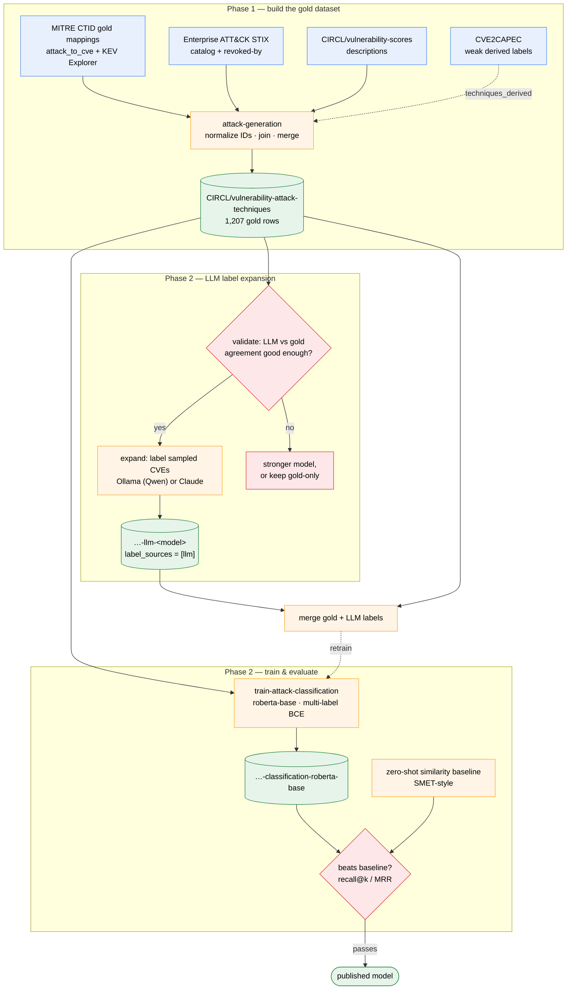

# CVE → MITRE ATT&CK techniques dataset

This page documents the methodology behind the
[CIRCL/vulnerability-attack-techniques](https://huggingface.co/datasets/CIRCL/vulnerability-attack-techniques)
dataset and the design decisions that led to it. The goal (tracked in
[VulnTrain issue #6](https://github.com/vulnerability-lookup/VulnTrain/issues/6))
is to train a model that suggests MITRE ATT&CK techniques from a
vulnerability description: CVSS tells you *how bad* a vulnerability is, CWE
tells you *what kind of flaw* it is, ATT&CK tells defenders *what adversary
behavior to expect and detect*. Very few public models cover that gap.

## Workflow at a glance



The full pipeline, in the order the commands are meant to be run (each step
is detailed in its own section below):

```bash
# 1. Build the curated dataset from the MITRE CTID gold mappings
vulntrain-dataset-attack-generation --output-dir ./attack-dataset       # dry run, local only
vulntrain-dataset-attack-generation --push --repo-id CIRCL/vulnerability-attack-techniques

# 2. Train the multi-label classifier (GPU recommended)
vulntrain-train-attack-classification --base-model roberta-base \
  --repo-id CIRCL/vulnerability-attack-technique-classification-roberta-base

# 3. Evaluate: the trained model must beat the zero-shot similarity baseline
vulntrain-validate-attack-classification --method similarity
vulntrain-validate-attack-classification --method classifier \
  --model CIRCL/vulnerability-attack-technique-classification-roberta-base

# 4. Grow the dataset with LLM-assisted labeling — local Ollama model (no
#    API key) or Claude; validate agreement against the gold set BEFORE expanding
vulntrain-dataset-attack-llm-labeling --mode validate --backend ollama --model qwen3.5:122b
vulntrain-dataset-attack-llm-labeling --mode expand --backend ollama --model qwen3.5:122b \
  --sample-n 300 --push --agreement-note "f1_micro 0.392 on the 121-CVE gold test split"

# 5. Retrain on the gold + LLM union (LLM rows go into train only) and re-run step 3
vulntrain-train-attack-classification --base-model roberta-base \
  --extra-dataset-id CIRCL/vulnerability-attack-techniques-llm-ollama-qwen3.5-122b \
  --repo-id CIRCL/vulnerability-attack-technique-classification-pilot
```

Steps 1–3 are done and published. Step 4's model selection is done
(qwen3.5:122b, f1_micro 0.392 agreement — see the benchmark below), and the
step-5 pilot (300-CVE expansion + union retrain) is **complete**: across five
seeds it gives a small but consistent ranking gain (recall@3 +0.038, recall@5
+0.030) though no rare-technique improvement — a single-run version had
misleadingly shown a *degradation* (see "Pilot expansion experiment" below).
Source files (CTID mappings, ATT&CK STIX data, CVE2CAPEC databases)
are cached in `~/.cache/vulntrain`.

## Candidate label sources, and what we measured

There is no large ground-truth CVE → ATT&CK dataset. The candidate sources
fall into two categories: small and hand-curated, or large and automatically
derived. We evaluated both before deciding.

### Gold sources: the MITRE CTID mappings (used as training labels)

The MITRE Center for Threat-Informed Defense (CTID) produced two mapping
efforts, both following the
["Mapping ATT&CK to CVE for Impact" methodology](https://github.com/center-for-threat-informed-defense/attack_to_cve/blob/master/methodology.md),
which assigns each CVE up to three kinds of techniques:

- **Exploitation technique** — how the vulnerability is exploited
  (e.g. T1190 *Exploit Public-Facing Application*).
- **Primary impact** — what the exploitation directly yields
  (e.g. T1059 *Command and Scripting Interpreter*).
- **Secondary impact** — what the attacker can do afterwards.

The two sources:

| Source | CVEs | ATT&CK version | Notes |
|--------|------|----------------|-------|
| [attack_to_cve](https://github.com/center-for-threat-informed-defense/attack_to_cve) (2021) | ~840 | v9 era | CSV, the original project |
| [Mappings Explorer KEV mappings](https://center-for-threat-informed-defense.github.io/mappings-explorer/) | ~420 | 16.1 | JSON, CISA Known Exploited Vulnerabilities, includes per-mapping justification comments |

Both are Apache-2.0 licensed. Together they cover 1,228 distinct CVEs
(1,207 rows after normalization and description joining) — small, but every
label was written by an analyst. The resulting technique distribution
matches what one would expect from real-world exploitation: T1190 (348),
T1059 (262), T1203 (213), T1068 (189), with 192 distinct techniques of
which 66 have at least 5 examples (57 once sub-techniques are collapsed to
their parent, which is what the trainer uses as its label vocabulary).

### Derived source: CVE2CAPEC (included, but not as training labels)

[CVE2CAPEC](https://github.com/Galeax/CVE2CAPEC) (Galeax, GPLv3) maintains a
daily-updated database chaining CVE → CWE → CAPEC → ATT&CK through the
official cross-framework mappings. It is an impressive piece of automation
with near-complete coverage, and it is referenced from issue #6, so we
analyzed whether its technique labels could serve as training targets.

Measurements on its `CVE-2024.jsonl` database file (39,156 CVEs):

- 88.3% of CVEs receive at least one technique — coverage is excellent.
- But the **fan-out is huge**: the median CVE gets between 4 and 20
  techniques, and 7,381 CVEs (19%) get 20 or more.
- The **most frequent technique overall is T1574.007** (*Path Interception
  by PATH Environment Variable*), tagged on **53% of all labeled CVEs** —
  followed by T1574.006, T1562.003 and T1134.001, all around 50%. These
  frequencies bear no relation to how vulnerabilities are actually
  exploited; they are artifacts of the CWE → CAPEC → ATT&CK table expansion,
  where one generic CWE fans out into dozens of CAPECs and techniques.
- Spot check: CVE-2024-21732, an XSS-family CVE (CWE-79), maps to 48 CAPECs
  and to techniques T1027 (*Obfuscated Files or Information*) and
  T1574.006/.007 (*Hijack Execution Flow*) — nothing related to XSS or
  drive-by exploitation.

**Conclusion**: training on these labels would teach the model the noise of
the mapping tables rather than adversary behavior. The derived techniques
are still valuable, so the dataset keeps them in a clearly separated
`techniques_derived` column, useful as:

1. a **candidate prior** at inference time (only suggest techniques
   compatible with the CWE chain);
2. a **baseline** that any trained model must beat;
3. a comparison column for studying where the deterministic chain diverges
   from analyst judgment.

### Other sources considered

- **BRON** (MIT Lincoln Laboratory): same CWE → CAPEC → ATT&CK chain as
  CVE2CAPEC, same noise profile.
- **TRAM** (CTID): maps *threat reports* to ATT&CK, not CVE descriptions —
  a different text distribution.
- Academic work: *CVE2ATT&CK* (Grigorescu et al., 2022) fine-tuned BERT on
  ~1,800 CVEs and 31 techniques; *SMET* (Abdeen et al., ACSAC 2023)
  deliberately avoided supervised classification because of label scarcity
  and used semantic similarity against ATT&CK technique descriptions
  instead. That SMET-style similarity ranking is exactly what
  `vulntrain-validate-attack-classification --method similarity` implements
  as the zero-shot baseline (see Training below).

## Pipeline

`vulntrain/datasets/attack_guesser_dataset.py` performs the following steps:

1. **Fetch** the two CTID mapping files.
2. **Normalize** every technique ID against the current enterprise ATT&CK
   STIX data ([attack-stix-data](https://github.com/mitre-attack/attack-stix-data)):
   techniques revoked since 2021 are remapped to their successor via the
   STIX `revoked-by` relationships (e.g. T1562 *Impair Defenses* → T1685
   *Disable or Modify Tools*, revoked in v19); deprecated techniques have no
   successor and are dropped with a warning. Mobile and ICS techniques
   (T1404, T0855, …) present in a handful of 2021 mappings are also dropped
   — the dataset targets the enterprise ATT&CK domain only, which costs
   about 20 mobile-focused CVEs. The ATT&CK version used is recorded in the
   `attack_version` column.
3. **Merge** the two sources per CVE (union of technique sets, provenance
   kept in `label_sources`).
4. **Join descriptions** from `CIRCL/vulnerability-scores`; CVEs missing
   there are fetched from the
   [Vulnerability-Lookup API](https://vulnerability.circl.lu) as a fallback.
5. **Attach** the CVE2CAPEC derived techniques as `techniques_derived`
   (skippable with `--skip-cve2capec`).
6. **Split** 90/10 into train/test and optionally push to the Hub.

Note that the KEV mappings URL points to a dated release directory; pass
`--kev-mappings-url` (or update the constant) when CTID publishes mappings
for a newer ATT&CK release.

## Dataset schema

| Column | Type | Description |
|--------|------|-------------|
| `id` | str | CVE identifier |
| `title` | str | Vulnerability title |
| `description` | str | English vulnerability description (model input) |
| `exploitation_techniques` | list[str] | CTID exploitation technique(s) |
| `primary_impact` | list[str] | CTID primary impact technique(s) |
| `secondary_impact` | list[str] | CTID secondary impact technique(s) |
| `techniques` | list[str] | Union of all curated techniques (training target) |
| `techniques_derived` | list[str] | CVE2CAPEC weak labels — **not** for training |
| `label_sources` | list[str] | `ctid_cve` and/or `ctid_kev` |
| `attack_version` | str | Enterprise ATT&CK version the IDs are normalized to |

## Known limitations

- **Size**: ~1,200 CVEs supports a proof-of-concept, not a production
  model. LLM-assisted label expansion (see below), validated against this
  gold set, addresses this.
- **Selection bias**: both CTID sets over-represent exploited-in-the-wild
  vulnerabilities (the KEV set by construction), so the technique
  distribution is skewed toward remote exploitation of servers compared to
  the full CVE corpus.
- **Version drift**: the 2021 mappings were made against ATT&CK v9;
  normalization fixes revoked IDs but cannot retroactively add
  sub-techniques an analyst working today might have chosen.
- **Inherent task ceiling**: a CVE description describes a flaw, while
  ATT&CK describes attacker behavior around it — even human annotators
  disagree on such mappings. Any model trained on this data should be
  presented as *suggesting candidate techniques* for analyst review, not as
  an authoritative mapping.

## Training (Phase 2)

The trainer is implemented in `vulntrain/trainers/attack_guesser.py`
(`vulntrain-train-attack-classification`):

- The task is **multi-label** (a CVE legitimately maps to several
  techniques): the model trains on the `techniques` column with a sigmoid
  head and binary cross-entropy loss, unlike the single-label CWE trainer.
  Per-label positive weights (`--class-weights`) counter class imbalance.
- Sub-techniques are collapsed to their parent technique at training time
  (the same trick as the CWE ancestor mapping), and the label vocabulary is
  restricted to techniques with at least `--min-examples` (default 5)
  training examples.
- Evaluation reports micro/macro F1 at the 0.5 threshold plus
  **recall@3/recall@5**, the metrics that matter for suggesting candidate
  techniques to an analyst.
- The weak `techniques_derived` column is intentionally ignored by the
  trainer.

The fine-tuned classifier and a zero-shot similarity baseline (SMET-style —
rank techniques by cosine similarity between the description embedding and
the official ATT&CK technique name+description, no training involved) are
evaluated with the same protocol by
`vulntrain-validate-attack-classification`
(`vulntrain/validators/attack_guesser.py`): both report the same recall@k
and MRR on the same test split and label vocabulary, so the numbers are
directly comparable. The fine-tuned model has to beat the zero-shot
baseline to justify existing.

### Model results (Phase 2)

The first trained model,
[CIRCL/vulnerability-attack-technique-classification-roberta-base](https://huggingface.co/CIRCL/vulnerability-attack-technique-classification-roberta-base)
(roberta-base, 57-technique vocabulary), roughly doubles the zero-shot
baseline on every ranking metric:

| Metric | Zero-shot baseline | Fine-tuned model |
|--------|-------------------|------------------|
| recall@3 | 0.257 | 0.482 |
| recall@5 | 0.322 | 0.686 |
| recall@10 | 0.491 | 0.842 |
| MRR | 0.397 | 0.620 |

So the supervised approach is justified even on ~1,100 training examples.
The remaining weakness is rare-technique performance (macro-F1 0.20), which
is what label expansion targets.

> **Note (2026-07-17).** The table above records the *first* trained model
> (pre-correction protocol, 57-technique vocabulary). The checkpoint
> published at that repo ID has since been retrained under the corrected
> protocol (seed 42, `--val-split 0.1`, 53-technique vocabulary); its
> expected metrics are the corrected-protocol numbers of record below.

## LLM-assisted label expansion (Phase 2)

`vulntrain/datasets/attack_llm_labeler.py`
(`vulntrain-dataset-attack-llm-labeling`) grows the training set beyond the
~1,200 curated CVEs by having an LLM label additional CVEs with the **same**
CTID methodology (exploitation technique / primary impact / secondary
impact), so the output stays schema-compatible with the gold set.

Two backends, selected with `--backend`:

- `ollama` (no API key, no per-token cost): labels with a local model served
  by an [Ollama](https://ollama.com) instance — e.g. Qwen — using Ollama
  structured outputs. Set `--model` (default `qwen3`; e.g. `qwen3:32b`) and,
  if the server is not local, `--ollama-url`.
- `anthropic`: labels with Claude via the Anthropic API. Requires an API key
  exported as `ANTHROPIC_API_KEY` (create one at
  [platform.claude.com](https://platform.claude.com); note that a Claude Max
  subscription does **not** include API access — it is billed separately).

The system prompt is identical for every CVE — the methodology, the full
active enterprise ATT&CK technique catalog (from the STIX data), and a set
of diverse few-shot examples drawn from the gold set — so both backends'
prompt-prefix caching keeps all but the first request cheap. The model
returns a structured mapping (constrained to the label schema on both
backends); hallucinated or out-of-catalog technique IDs are dropped, and the
Ollama backend retries on malformed output.

The `validate` gate matters most with a local model: it tells you
objectively whether the chosen Ollama model agrees with the analysts well
enough to trust, or whether the gap justifies paying for the API.

**Raising agreement.** By default each CVE is labeled in a single constrained
call. Because the JSON-schema grammar forces the model to emit the answer
immediately, a *thinking* model (e.g. Qwen) cannot reason first — which tends
to depress recall. Pass `--reason` for a two-step pass: an unconstrained
analysis (the model reasons freely) followed by a constrained extraction of
the technique IDs from that analysis. It roughly doubles the per-CVE time, so
compare it against the single-call baseline on a small `--limit` before
committing to a full run. Any change to the model, the prompt, or `--reason`
invalidates a previous agreement number — re-run `validate` to re-baseline.

**Model-selection benchmark.** We measured LLM-vs-gold agreement on a
held-out slice of the CTID gold set, at the parent-technique granularity the
trainer uses, to pick the best model to expand with. We use the trained
classifier's own agreement with gold (**f1_micro ~0.41**) as a *reference*
level — the intuition being that a labeler below it adds labels noisier than
the model's own predictions. This is a reference, not a hard gate: the seed
sweep below shows labels at 0.39 agreement still help ranking in aggregate, so
the figure contextualises the labeler rather than accepting or rejecting it.

| Backend / model | Prompt & mode | Sample | Precision | Recall | **f1_micro** | Notes |
|---|---|---|---:|---:|---:|---|
| ollama / qwen3.6:35b | conservative, single-call | 30 | 0.429 | 0.248 | 0.314 | original baseline |
| ollama / qwen3.6:35b | assertive, single-call | 30 | 0.442 | 0.271 | 0.336 | prompt helps marginally |
| ollama / qwen3.6:35b | assertive, `--reason` | 30 | 0.395 | 0.214 | 0.278 | worse; reasoning pass times out, drops CVEs |
| _supervised classifier_ | _(trained on gold)_ | 121 | — | — | _~0.41_ | _reference level_ |
| ollama / qwen3.5:122b | assertive, single-call | 30 | 0.509 | 0.429 | 0.465 | optimistic on the small slice |
| **ollama / qwen3.5:122b** | **assertive, single-call** | **121** | **0.431** | **0.360** | **0.392** | **full split — the reliable figure** |

Few-shot examples: 8, identical across rows. The 35B rows and the first 122B
row share one 30-CVE slice; the final row is the full 121-CVE `test` split.
Three findings emerge:

1. **Model capacity, not prompt engineering, is the binding constraint.** On
   the 30-CVE slice the assertive prompt lifted the 35B by only +0.02 f1, while
   moving to the 122B lifted it by +0.13, almost entirely by fixing recall
   (0.27 → 0.43). The smaller model *under-predicts* — it agrees when it
   commits, but stays silent too often. Capacity is what buys the commitment.
2. **Two-step `--reason` did not pay off on a mid-size thinking model.** On the
   *same* 30 CVEs it scored below single-call (0.278 vs 0.336), and the
   unconstrained reasoning pass on the 35B repeatedly exceeded the Ollama
   timeout, dropping whole CVEs to empty labels. It may still help a larger box
   with a longer timeout, but it is not a substitute for model size.
3. **Small validation slices are optimistic — always confirm on the full
   split.** The 122B scored 0.465 on 30 CVEs but **0.392 on the full 121**, a
   0.07 f1 drop driven mostly by recall (0.43 → 0.36). At n=30 the agreement
   metric has enough variance to mislead a go/no-go decision, so the full-split
   number is the one of record.

**Selected expansion model: qwen3.5:122b (single-call, assertive prompt), at
f1_micro 0.392 on the full test split.** This sits marginally *below* the
classifier's own ~0.41 agreement — so on the benchmark alone the LLM is not
clearly better than the trained model at reproducing gold. That made it a
best-case candidate to *test* rather than a sure thing; the seed sweep below is
what actually decides it. Its agreement is within the range commonly reported
for inter-analyst agreement on technique-level ATT&CK CVE mappings, and it is
used for *provenance-tiered* expansion (new CVEs, `label_sources=["llm"]`),
never as a silent replacement for gold labels. Throughput is ~1.4 min/CVE on
our GPU server (2× NVIDIA H100 NVL, Ollama): the 1000-CVE scaling batch took
23h03m and kept 984 CVEs, pushed as
`CIRCL/vulnerability-attack-techniques-llm-scaling`.

**Validate before trusting expansion.** Run the `validate` mode first: it
labels a held-out slice of the *gold* set and reports agreement
(precision/recall/F1 at the parent-technique level) between the model and
the analysts.

```bash
# Local model via Ollama (no API key):
vulntrain-dataset-attack-llm-labeling --mode validate --backend ollama --model qwen3.6:35b

# Or Claude via the Anthropic API:
export ANTHROPIC_API_KEY=sk-ant-...
vulntrain-dataset-attack-llm-labeling --mode validate --backend anthropic
```

Only if that agreement is comparable to inter-analyst agreement on ATT&CK
mappings should you scale up. The `expand` mode then labels a sample of
CVEs (from `CIRCL/vulnerability-scores` by default, excluding gold CVEs) and
writes a dataset with `label_source = ["llm"]` plus the backend/model ID and
its justification comment per row:

```bash
vulntrain-dataset-attack-llm-labeling --mode expand --backend ollama --model qwen3.6:35b \
  --sample-n 2000 --push --repo-id CIRCL/vulnerability-attack-techniques-llm \
  --agreement-note "f1_micro 0.61 on the 121-CVE test split"
```

Each run **appends the backend/model slug to `--repo-id`** (so the example
above pushes to `…-llm-ollama-qwen3.6-35b`) and writes a dataset card
recording the labeling model, the CVE count, and — via `--agreement-note` —
the validation score. This keeps multiple test runs (one per model)
distinguishable rather than overwriting one another; the exact model is also
stored per row in the `llm_model` column. Pass `--no-model-suffix` to push to
`--repo-id` verbatim.

Keep the LLM-labeled rows in a separate provenance tier: merge them with the
gold set for training, but always retain the `label_sources` column so
consumers can filter back to gold-only, and **publish the measured
validation agreement on the expanded dataset card** (the `--agreement-note`
flag does exactly this) so the labels' quality is documented rather than
assumed.

### Retraining on the gold + LLM union

The trainer merges the two provenance tiers through `--extra-dataset-id`:

```bash
vulntrain-train-attack-classification --base-model roberta-base \
  --extra-dataset-id CIRCL/vulnerability-attack-techniques-llm-ollama-qwen3.5-122b \
  --repo-id CIRCL/vulnerability-attack-technique-classification-pilot
```

The extra rows are concatenated into the **train split only**; the gold
**test split is left untouched**. This is the crucial part of the experimental
design: the yardstick stays gold-only, so the union model's test metrics are
directly comparable to the gold-only model's. Use a **distinct `--repo-id`**
(e.g. a `-pilot` suffix) so the experiment never overwrites the production
gold-only model.

### Pilot expansion experiment

To decide whether LLM expansion is worth scaling, we run a small, measurable
pilot rather than committing to a full expansion up front.

**Design.**

1. `expand` 300 new non-gold CVEs with the selected model (qwen3.5:122b,
   single-call, assertive prompt), recording the 0.392 full-split agreement on
   the dataset card via `--agreement-note`.
2. Retrain the classifier on the **gold-train + LLM** union with
   `--extra-dataset-id`, evaluating on the untouched gold test split.
3. Compare against the gold-only baseline on the **same** test split.

**Success criterion.** The pilot succeeds if **recall rises** — especially
`recall_at_5` and `f1_macro` (which weights rare techniques equally) — without
`f1_micro` collapsing. The hypothesis under test is that LLM labels, even at
0.39 agreement, add coverage of rare techniques that the ~1,200-CVE gold set
under-represents. A flat or worse result means expansion does not pay off at
this agreement level, and the gold-only model stays the product.

> **Important — this experiment produced three successive verdicts, and only
> the last survives.** The single-run pilot (seed 42) said expansion *degrades*
> the model. A five-seed sweep said it *helps* (small consistent ranking gain).
> An independent replication plus an expansion-size scaling sweep showed both
> were artifacts: **expansion at ~0.39 agreement gives no reliable gain at any
> size from 100 to 984 rows, and degrades rare-technique macro-F1 at scale.**
> The root cause of the churn was evaluation noise from best-checkpoint
> selection on the small test split (now fixed in the trainer — see below).
> The earlier tables are kept as cautionary examples.

**Single-run pilot (seed 42) — misleading.** Both models were trained with
identical code, seed (42), and hyper-parameters; the only difference is the 297
LLM-labeled rows folded into training (train split only; gold test untouched).
The gold-only figures are a *matched* re-run under the current code (f1_micro
0.407; the old 0.42 was a slightly different configuration).

| Metric | Gold-only (seed 42) | Gold + LLM (seed 42) | Δ |
|---|---:|---:|---:|
| f1_micro | 0.407 | 0.395 | −0.012 |
| f1_macro | 0.185 | 0.164 | −0.021 |
| recall_micro | 0.625 | 0.626 | +0.001 |
| recall_at_3 | 0.546 | 0.491 | −0.055 |
| recall_at_5 | 0.683 | 0.633 | −0.050 |

Taken alone this says expansion hurts. That conclusion did not survive — though
the reason turned out to be subtler than first thought (see the mechanism
below).

**Five-seed sweep (seeds 42–46) — appeared to reverse it; second cautionary
example.** Mean ± std across seeds; Δ is the mean of the paired per-seed
differences. "Consistent" marks |Δ| > 2·SEM (see `--seed` on the trainer and
`aggregate_sweep.py`). At the time this was adopted as the number of record;
the replication below showed the gold-only column had drawn low.

| Metric | Gold-only | Gold + LLM | Δ (paired) | |
|---|---:|---:|---:|---|
| recall_at_3 | 0.506 ± 0.019 | **0.544 ± 0.023** | +0.038 | consistent ↑ |
| recall_at_5 | 0.641 ± 0.019 | **0.670 ± 0.033** | +0.030 | consistent ↑ |
| f1_micro | 0.405 ± 0.019 | **0.424 ± 0.010** | +0.020 | consistent ↑ |
| f1_macro | 0.177 ± 0.012 | 0.173 ± 0.017 | −0.004 | within noise |
| recall_micro | **0.651 ± 0.013** | 0.636 ± 0.007 | −0.015 | consistent ↓ |

**Scaling sweep + replication (2026-07-15) — the result of record.** A fresh,
independently sampled batch of 1,000 CVEs was labeled with the same
configuration (984 kept, pushed as
`CIRCL/vulnerability-attack-techniques-llm-scaling`), and the trainer's
`--extra-max-rows` folded in the first N rows (nested subsets), five seeds per
size, against a matched gold-only baseline from the same session
(`scaling_sweep.py`):

| N extra rows | recall_at_3 | recall_at_5 | f1_micro | f1_macro |
|---:|---|---|---|---|
| 0 | 0.531 ± 0.025 | 0.682 ± 0.021 | 0.418 ± 0.016 | 0.189 ± 0.014 |
| 100 | 0.534 ± 0.018 | 0.655 ± 0.025 | 0.408 ± 0.022 | 0.170 ± 0.013 |
| 300 | 0.523 ± 0.016 | 0.671 ± 0.011 | 0.412 ± 0.014 | 0.175 ± 0.006 |
| 600 | 0.536 ± 0.024 | 0.656 ± 0.031 | 0.416 ± 0.026 | 0.175 ± 0.004 |
| 984 | 0.532 ± 0.018 | 0.651 ± 0.013 | 0.437 ± 0.013 | 0.150 ± 0.007 |

No size reproduces the five-seed gain: recall@3 is flat, recall@5 *declines*
at full size (−0.031, 2.8 SEM), f1_macro degrades markedly (−0.039, 5.6 SEM —
the strongest effect in the sweep), and only f1_micro edges up at 984 (+0.019,
borderline 2.1 SEM). Re-running the *original* 297-row union in the same
session reproduced its recall@5 almost exactly (0.670 ± 0.007 vs 0.670 ±
0.033 in the old sweep) — but against the matched baseline of 0.682 ± 0.021,
not 0.641. **The five-seed "gain" was a low-drawn gold baseline, not a
property of the union model.**

**The mechanism — evaluation noise from checkpoint selection.** The trainer
picked the best of 40 per-epoch checkpoints by macro-F1 *on the 119-example
test split*. Per-epoch evals of a split that small wobble hugely (recall@5
spans 0.62–0.70 within one run), so the reported metric is an argmax over 40
noisy evaluations, and ordinary GPU nondeterminism changes which epoch wins:
three runs of the *identical* gold-only configuration (same seed, data, code,
hardware) reported recall@5 of 0.636, 0.683, and 0.685 — a 0.048 spread from
evaluation noise alone. This defeats single runs *and* the paired 2·SEM test.
Fixed in the trainer: `--val-split` (default 0.1) carves a gold-only
validation split for checkpoint selection so the test split is evaluated
exactly once, and `--deterministic` (transformers `full_determinism`) makes
fixed-seed runs bit-reproducible — note it sets `CUDA_LAUNCH_BLOCKING=1`,
which **deadlocks multi-GPU DataParallel** (observed on 2× H100: zero steps in
eight hours; the trainer now refuses to start with more than one visible GPU)
and slows single-GPU training. Reserve it for single-GPU archival runs
(`CUDA_VISIBLE_DEVICES=0`); a multi-seed sweep already averages over
run-to-run noise and does not need it.
Numbers above predate the fix (mild
select-on-test optimism, same on both sides of every comparison).

**Numbers of record (corrected protocol, 2026-07-16).** Gold-only,
`--val-split 0.1` (972 train / 106 validation / 118 test), five seeds
(42–46):

| recall@5 | recall@3 | micro-F1 | macro-F1 |
|---|---|---|---|
| 0.673 ± 0.019 | 0.536 ± 0.032 | 0.410 ± 0.006 | 0.177 ± 0.014 |

As predicted, about one point below the pre-correction values (0.682 /
0.531 / 0.418 / 0.189) and within noise of them — an upper bound on the
select-on-test optimism that also absorbs the 10% of training data ceded to
the validation split. Micro-F1's run-to-run std drops from ±0.016 to ±0.006:
selecting checkpoints on a dedicated split removes variance, not just bias.

**The verdict under the corrected instrument (2026-07-16).** The decisive
contrast re-run under the corrected protocol — the same five seeds, gold-only
vs the 297-row union vs all 984 LLM rows:

| training data | recall@5 | recall@3 | micro-F1 | macro-F1 |
|---|---|---|---|---|
| gold only | **0.673 ± 0.019** | 0.536 ± 0.032 | 0.410 ± 0.006 | **0.177 ± 0.014** |
| gold + 297 LLM rows | 0.655 ± 0.027 | 0.511 ± 0.023 | 0.404 ± 0.012 | 0.169 ± 0.009 |
| gold + 984 LLM rows | 0.651 ± 0.022 | 0.534 ± 0.012 | 0.427 ± 0.028 | 0.151 ± 0.014 |

The null verdict is confirmed with the cleaner instrument: no ranking gain at
either size (at 297 rows *every* metric sits at or below gold-only — no trace
of the once-"consistent" gain), the macro-F1 degradation at scale is
confirmed (−0.026, ≈2.9 SEM), and the borderline micro-F1 uptick at 984
persists unresolved (+0.017, ≈1.3 SEM).

**Gold labels scale; LLM labels do not (2026-07-16).** The natural control:
train on nested subsets of the gold train split (`--train-fraction`, label
vocabulary and test set frozen to the full-gold ones, five seeds each):

| gold rows | recall@5 | recall@3 | micro-F1 | macro-F1 |
|---|---|---|---|---|
| 243 | 0.556 ± 0.034 | 0.384 ± 0.045 | 0.328 ± 0.013 | 0.114 ± 0.018 |
| 484 | 0.623 ± 0.023 | 0.475 ± 0.019 | 0.383 ± 0.014 | 0.153 ± 0.017 |
| 725 | 0.656 ± 0.037 | 0.507 ± 0.015 | 0.395 ± 0.028 | 0.173 ± 0.035 |
| 972 | 0.673 ± 0.019 | 0.536 ± 0.032 | 0.410 ± 0.006 | 0.177 ± 0.014 |

Every metric rises monotonically with gold size, and the curve has not
saturated. The contrast with expansion is stark: the last ~250 gold rows add
+0.017 recall@5, while 297 LLM rows added to the same full gold set
*subtract* 0.018. The classifier is label-quality bound, not data bound —
growing the curated set is the one intervention with measured payoff.

> **Protocol warning.** A naive version of this experiment — rebuilding the
> label vocabulary from each subset — *inverts* the macro-F1 trend (0.282 at
> 243 rows): smaller train sets yield smaller vocabularies, an easier
> averaging set, and (through the in-vocabulary test filter) an easier test
> set. `--train-fraction` therefore freezes the vocabulary and test set to
> the full-gold ones.

**Base-model robustness check (2026-07-17).** The same contrast re-run on
`answerdotai/ModernBERT-base` — ten runs, corrected protocol, five seeds ×
{gold-only, gold + 984 LLM rows} — deliberately slimmed from a full encoder
grid to a robustness check:

| encoder | training data | recall@5 | recall@3 | micro-F1 | macro-F1 |
|---|---|---|---|---|---|
| roberta-base | gold only | 0.673 ± 0.019 | 0.536 ± 0.032 | 0.410 ± 0.006 | 0.177 ± 0.014 |
| roberta-base | gold + 984 LLM rows | 0.651 ± 0.022 | 0.534 ± 0.012 | 0.427 ± 0.028 | 0.151 ± 0.014 |
| ModernBERT-base | gold only | 0.614 ± 0.018 | 0.503 ± 0.017 | 0.416 ± 0.020 | 0.180 ± 0.014 |
| ModernBERT-base | gold + 984 LLM rows | 0.635 ± 0.029 | 0.524 ± 0.023 | 0.450 ± 0.020 | 0.152 ± 0.015 |

Three take-aways. (1) The newer encoder does **not** raise the ceiling:
micro/macro-F1 are a wash and both ranking metrics are clearly lower
(recall@5 −0.059, ≈5 SEM) — `roberta-base` stays the released default.
(2) The expansion verdict **replicates on a second encoder**: macro-F1 again
degrades (0.180 → 0.152, ≈3.1 SEM) and recall@5 again shows no reliable gain
(+0.021, ≈1.4 SEM). (3) The micro-F1 uptick that was borderline on
roberta-base resolves here (+0.034, ≈2.7 SEM) — LLM rows concentrated on head
techniques buy example-weighted F1 while eroding the tail, consistent with
the mechanism above.

**Decision.** Expansion at ~0.39 agreement is **not worth folding in**: no
reliable ranking gain at any size, and a real rare-technique cost at scale.
The gold-only model stays the product. The result also vindicates the
"reference level" heuristic — a labeler agreeing below the classifier's own
accuracy (0.392 < 0.407) added nothing the model didn't already know.

The methodological lesson matters as much as the metrics: multi-seed reporting
was **necessary but not sufficient** — the five-seed comparison passed its own
consistency criterion and was still wrong. In this regime you also need a
selection split that is not the test split, deterministic (or repeated) runs,
and replication on an independent sample before believing a small effect.

### Inspecting a single CVE

`vulntrain-infer-attack-classification` runs one description (or one CVE
looked up in the gold dataset, with its gold techniques shown) through a
trained checkpoint:

```bash
vulntrain-infer-attack-classification --cve CVE-2021-44077 \
  --model CIRCL/vulnerability-attack-technique-classification-roberta-base

CVE-2021-44077 (test split)
gold techniques: T1003, T1027, T1047, T1070, T1087, T1136, T1140, T1190, ...
rank  technique   prob  pred  gold  name
   1  T1133       0.72   *          External Remote Services
   2  T1190       0.72   *     +    Exploit Public-Facing Application
   3  T1059       0.70   *          Command and Scripting Interpreter
   4  T1005       0.63   *          Data from Local System
   5  T1505       0.58   *     +    Server Software Component
```

Running the same CVE through the published negative-result checkpoint
[`...-roberta-base-llm-expanded`](https://huggingface.co/CIRCL/vulnerability-attack-technique-classification-roberta-base-llm-expanded)
(gold + 984 LLM rows; released for reproducibility of the expansion
experiment, not for use) shows the expansion mechanism on one example: the
head call T1190 gains confidence (0.72 → 0.75) while the rest of the gold
mapping deflates — T1505 drops below the 0.5 prediction threshold, T1003
falls from rank 8 to 17, and the tail technique T1136 (5 training examples)
from rank 18 to 32.

### Published model repositories

- [`...-roberta-base`](https://huggingface.co/CIRCL/vulnerability-attack-technique-classification-roberta-base)
  — **the model**: gold-only, corrected protocol, seed 42.
- [`...-roberta-base-llm-expanded`](https://huggingface.co/CIRCL/vulnerability-attack-technique-classification-roberta-base-llm-expanded)
  — negative-result comparison checkpoint (gold + 984 LLM rows), published
  so the expansion verdict and the single-CVE example are reproducible.
- [`...-classification-pilot`](https://huggingface.co/CIRCL/vulnerability-attack-technique-classification-pilot)
  — the pilot expansion experiment's checkpoint; superseded, kept only as a
  stage of the released experiment history.

### Still to do

- ~~Retrain and republish the released checkpoint~~ — done 2026-07-17
  (corrected protocol, seed 42; the `-llm-expanded` companion published at
  the same time). Optionally one single-GPU `--deterministic` archival run.
- **Raise labeler agreement** before any further expansion attempt — stronger
  model, human-reviewed silver labels, or high-confidence slots only — aimed at
  the long tail that `f1_macro` shows is the binding constraint.
- **Stratify any future expansion sample by CWE** so it isn't dominated by the
  most common weakness classes (XSS, SQLi); the current `expand` mode samples
  CVEs without stratification.
- **Grow the gold set directly** (more CTID-style curated mappings) — the
  gold scaling curve shows every metric still rising at 972 training rows,
  so this is the intervention with measured payoff.
- ~~Base-model comparison~~ — done as a slimmed robustness check
  (ModernBERT-base, 2026-07-17, table above): roberta-base stays the default,
  the expansion verdict replicates. A full encoder search (roberta-large,
  SecureBERT) remains optional future work.
